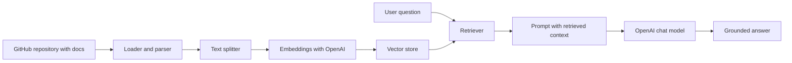

Retrieval-augmented generation, or RAG, helps you build documentation assistants that answer questions from your own content instead of guessing from general model knowledge. For technical writers and documentation teams, that matters because your source of truth usually lives in Markdown files, diagrams, release notes, and API references. A RAG pipeline can turn that content into a searchable knowledge base that stays close to your published docs.

This guide shows you how to build a practical documentation RAG pipeline with three common building blocks:

- GitHub for storing and versioning the documentation source
- OpenAI for embeddings and answer generation
- LangChain for ingestion, chunking, retrieval, and orchestration

## What a documentation RAG pipeline does

A RAG pipeline combines retrieval and generation. It first finds the most relevant content from your documentation, then sends that content to a large language model to produce a grounded answer.

In a documentation workflow, the pipeline usually looks like this:

1. Pull Markdown files from a GitHub repository.
2. Split the content into smaller chunks.
3. Create embeddings for each chunk.
4. Store the vectors in a vector database.
5. Retrieve the most relevant chunks when a user asks a question.
6. Send the retrieved context to OpenAI to generate the final response.

This approach helps reduce hallucinations and keeps answers tied to the documentation that your team actually maintains.

## Why GitHub is a good source of truth

GitHub is a strong fit for documentation because it already supports the habits teams use to maintain technical content.

- It tracks changes with version history.
- It supports pull requests, code review, and approvals.
- It makes it easy to separate drafts, stable docs, and release-specific branches.
- It works well with Markdown, front matter, images, and code samples.

When you use GitHub as the source system, your RAG pipeline can always ingest the latest approved version of the docs. That makes the assistant easier to trust and easier to update.

## Reference architecture

Here is a simple architecture you can use for a documentation assistant.



The important design choice is to keep ingestion and question answering separate. Ingestion runs when docs change. Retrieval runs when a user asks a question.

## Set up the project

Start with a Python environment and install the libraries you need.

```bash
pip install langchain langchain-community langchain-openai chromadb openai tiktoken gitpython python-dotenv
```

You will also need an OpenAI API key in your environment.

```bash
export OPENAI_API_KEY="your-api-key"
```

If you work on Windows PowerShell, use this format instead:

```powershell
$env:OPENAI_API_KEY="your-api-key"
```

## Clone and load documentation from GitHub

If your docs live in a GitHub repository, clone the repo or pull the Markdown files directly into your ingestion job. A GitHub clone is often the easiest option because it preserves the folder structure that your docs site already uses.

```bash
git clone https://github.com/your-org/your-docs-repo.git
cd your-docs-repo
```

For a documentation assistant, you usually want to ingest only the files that matter:

- Markdown pages
- API reference files
- Markdown notes in docs folders
- Release notes and changelogs

Exclude build output, generated HTML, and assets that do not help answer questions.

## Load and split the documents with LangChain

LangChain gives you document loaders and splitters that work well for Markdown-based content. A typical approach is to load each Markdown file, then split it into chunks that preserve meaning.

```python
from pathlib import Path
from langchain_core.documents import Document
from langchain_text_splitters import RecursiveCharacterTextSplitter

def load_markdown_documents(root_folder: str) -> list[Document]:
    documents = []
    for path in Path(root_folder).rglob("*.md"):
        text = path.read_text(encoding="utf-8")
        documents.append(
            Document(
                page_content=text,
                metadata={"source": str(path)}
            )
        )
    return documents


documents = load_markdown_documents("./docs")

splitter = RecursiveCharacterTextSplitter(
    chunk_size=1000,
    chunk_overlap=200,
)

chunks = splitter.split_documents(documents)
```

Chunking is important because large documents are harder to retrieve accurately. Smaller chunks improve retrieval precision, but overly small chunks can remove context. For docs, a chunk size around 800 to 1,200 characters is a useful starting point.

## Create embeddings with OpenAI

Embeddings convert text into vectors that capture semantic meaning. You use them to compare a user question with your documentation chunks.

```python
from langchain_openai import OpenAIEmbeddings

embeddings = OpenAIEmbeddings(model="text-embedding-3-small")
```

For most documentation projects, the smaller embedding model is enough to start. If you have a very large corpus or need stronger semantic quality, you can evaluate a larger model later.

## Store the vectors in a vector database

You need a vector store to index the chunk embeddings and retrieve similar content at query time. Chroma is a simple option for local development.

```python
from langchain_community.vectorstores import Chroma

vectorstore = Chroma.from_documents(
    documents=chunks,
    embedding=embeddings,
    persist_directory="./chroma-docs-store",
)

vectorstore.persist()
```

In a production system, you can replace Chroma with another store such as Pinecone, Weaviate, or FAISS, depending on your scale and deployment needs.

## Build the retriever

The retriever is the part of the pipeline that finds the most relevant documentation chunks for a question.

```python
retriever = vectorstore.as_retriever(search_kwargs={"k": 4})
```

The value of `k` controls how many chunks you send to the model. Start with 3 to 5 and test answer quality with real user questions.

## Generate grounded answers with OpenAI

Once you have retrieved context, send it to an OpenAI chat model with a prompt that tells the model to answer only from the provided documentation.

```python
from langchain_openai import ChatOpenAI
from langchain_core.prompts import ChatPromptTemplate

llm = ChatOpenAI(model="gpt-4.1-mini", temperature=0)

prompt = ChatPromptTemplate.from_messages([
    (
        "system",
        "You are a documentation assistant. Answer only from the provided context. "
        "If the context does not contain the answer, say you do not have enough information."
    ),
    (
        "user",
        "Question: {question}\n\nContext:\n{context}"
    ),
])
```

Low temperature helps keep answers consistent and reduces creative guessing. For documentation use cases, that is usually better than a more open-ended response style.

## Connect retrieval and generation

The final step is to combine the retriever and the model into a single question-answering flow.

```python
def answer_question(question: str) -> str:
    docs = retriever.invoke(question)
    context = "\n\n".join(doc.page_content for doc in docs)

    messages = prompt.format_messages(question=question, context=context)
    response = llm.invoke(messages)
    return response.content


print(answer_question("How do I update the API authentication token?"))
```

This function is small, but it shows the full RAG loop:

- retrieve relevant documentation
- format the retrieved text as context
- ask the model to answer from that context

## Make the answers useful for writers and readers

Good documentation assistants do more than answer questions. They also help users trust the response.

Add these behaviors to your prompt or application logic:

- Return citations or source file names.
- Say when the documentation does not contain enough information.
- Prefer exact phrasing from the docs when possible.
- Keep answers short unless the user asks for more detail.
- Show the section title or path of the source document.

For example, you can format the output like this:

```text
Answer: The token expires after 24 hours.

Source: docs/authentication.md
```

That makes the assistant more transparent and easier to validate.

## Add GitHub-driven updates

The best documentation assistants stay current when the source docs change. You can automate ingestion with a GitHub Actions workflow or a scheduled job.

Common update patterns include:

- Rebuild the vector index on every merge to the main branch.
- Reindex only changed Markdown files.
- Trigger ingestion when a docs pull request is merged.
- Keep one index per branch if you need preview environments.

If your docs team already uses GitHub pull requests, you can attach reindexing to the same review and publish flow.

## Evaluate the pipeline

RAG systems need testing just like any other documentation feature. Check whether the assistant returns the right answer, uses the right source, and avoids unsupported claims.

Test questions in three groups:

1. Clear factual questions with direct answers in the docs.
2. Ambiguous questions that require the assistant to ask for clarification or say it lacks context.
3. Out-of-scope questions that should not be answered from the documentation.

Track simple quality signals:

- retrieval relevance
- answer accuracy
- citation quality
- refusal behavior when content is missing

## Common mistakes to avoid

- Using large chunks that bury the relevant answer.
- Indexing generated output instead of source documentation.
- Letting the model answer from memory instead of retrieved context.
- Ignoring versioning, which can mix old and new API behavior.
- Skipping evaluation and assuming the assistant is correct because it sounds confident.

## Example documentation use cases

RAG works well for several documentation scenarios:

- Search across product manuals and setup guides
- Answer API usage questions from reference docs
- Explain release changes from changelogs
- Help support teams find internal process documentation
- Provide onboarding answers from a knowledge base

If your content is already organized in GitHub, LangChain and OpenAI can turn it into a useful assistant without replacing your existing docs workflow.

## Final thoughts

For documentation teams, RAG is most effective when it is treated as a publishing workflow, not just an AI demo. GitHub gives you a clean source of truth, LangChain helps you build the retrieval pipeline, and OpenAI provides the reasoning layer that turns retrieved text into useful answers.

Start small with one docs folder, a simple vector store, and a tight prompt. Once the basics work, add citations, evaluation, and automated reindexing. That gives you a documentation assistant that stays grounded in the content your team already maintains.