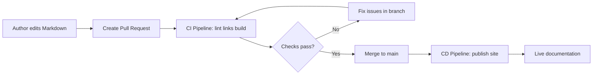

If your documentation still lives in scattered files, email threads, or one-off edits, you are not alone. Most teams start there. The problem appears later, when updates become slow, reviewers miss changes, and readers lose trust because the docs do not match the product.

Docs as code solves this by treating documentation like software: versioned, reviewed, tested, and published through an automated pipeline.

This article shows you a practical way to set up docs as code using GitHub, with a CI/CD pipeline that gives your team confidence that every documentation change is traceable and publish-ready.

## What docs as code means in practice

Docs as code is not about turning writers into developers. It is about using engineering workflows to make docs more reliable.

In a docs-as-code setup, you usually:

- Write docs in Markdown.
- Store docs in a GitHub repository.
- Review changes with pull requests.
- Run quality checks automatically.
- Publish docs through a pipeline.

The result is simple: documentation changes follow a clear path from draft to published page.

## Why GitHub is a strong fit

GitHub gives you the building blocks without requiring extra platforms:

- Version history: every change is tracked.
- Pull requests: changes are reviewed before merge.
- Branching: work in progress stays isolated.
- Actions: automate checks and publishing.
- Issues and project boards: track doc work like product work.

For technical writing teams, this creates a shared system where writers, developers, and reviewers can work in one place.

## Suggested repository structure

Start with a structure that is easy to navigate:

```text
/docs
  /guides
  /api
  /release-notes
  /images
/.github
  /workflows
README.md
STYLE_GUIDE.md
```

Keep filenames readable and consistent. Your future self will thank you when the docs grow.

## Step 1: Create and configure the GitHub repository

1. Create a new repository (or use your existing docs repository).
2. Add branch protection on `main` so direct pushes are blocked.
3. Require at least one pull request review before merge.
4. Add a `README.md` explaining contribution steps.
5. Add a `STYLE_GUIDE.md` for writing conventions.

This is the governance layer. It keeps quality steady as more contributors join.

## Step 2: Define your docs workflow

A simple workflow that works well for most teams:

1. Create a feature branch for each docs change.
2. Update or add Markdown files.
3. Open a pull request with context and screenshots if needed.
4. Get review from writer, SME, or engineer.
5. Merge to `main`.
6. Let the pipeline validate and publish.

This process keeps docs changes visible and reduces last-minute surprises.

## Step 3: Add automation checks in the pipeline

Before publishing, your pipeline should answer one question: "Is this change safe to release?"

Common checks include:

- Markdown linting
- Link validation
- Spelling/style checks (for example, Vale)
- Build validation (for static site generators such as Jekyll)

These checks catch problems early and reduce manual review effort.

## Step 4: Understand CI/CD pipelines for documentation

A pipeline is an automated sequence of steps that runs when docs change.

- CI (Continuous Integration): validates documentation changes.
- CD (Continuous Delivery/Deployment): publishes approved changes.

Think of it like an assembly line for documentation quality.



### Typical CI stages

1. Checkout repository
2. Install dependencies
3. Run lint and style checks
4. Run link checker
5. Build the site
6. Report status back to pull request

### Typical CD stages

1. Trigger on merge to `main`
2. Build production docs
3. Deploy to hosting target (for example, GitHub Pages)
4. Optionally notify team in Slack or Teams

## Step 5: Example GitHub Actions workflow

This is a practical starting point for a Markdown/Jekyll-based docs site.

```yaml
name: Docs CI

on:
  pull_request:
    paths:
      - 'docs/**'
      - '*.md'
      - '.github/workflows/**'

jobs:
  validate-docs:
    runs-on: ubuntu-latest

    steps:
      - name: Checkout
        uses: actions/checkout@v4

      - name: Setup Ruby
        uses: ruby/setup-ruby@v1
        with:
          ruby-version: '3.3'
          bundler-cache: true

      - name: Build docs site
        run: bundle exec jekyll build

      - name: Check links
        run: |
          gem install html-proofer
          htmlproofer ./_site --disable-external
```

You can start small. Even one or two checks are better than none.

## Step 6: Add human-friendly review habits

Pipelines help with mechanical quality, but humans protect clarity.

During review, ask:

- Is the user intent clear in the first paragraph?
- Are steps complete and testable?
- Are prerequisites explicit?
- Is error handling explained?
- Is terminology consistent with the product UI?

Automation catches broken links. Humans catch confusion.

## Common pitfalls and how to avoid them

- Too many checks on day one: start with essential checks, expand gradually.
- No style guide: reviewers spend time debating tone and terms.
- Weak ownership: assign a docs owner for each area.
- Pipeline-only mindset: quality still needs thoughtful editorial review.
- Missing rollback plan: keep previous published versions accessible.

## Recommended rollout plan for teams

Week 1:

- Move core docs into GitHub.
- Define branch and PR rules.
- Publish a contribution guide.

Week 2:

- Add CI checks (lint, links, build).
- Fix baseline issues.

Week 3:

- Enable CD deploy on merge.
- Add release notes and ownership model.

Week 4 and beyond:

- Add style checks and docs metrics.
- Review and tune pipeline duration and noise.

## How this helps your users

A docs-as-code pipeline does more than make teams efficient. It helps readers trust your documentation because it is:

- Current: tied to release workflow
- Consistent: reviewed and style-checked
- Reliable: validated before publish
- Transparent: every change is traceable

That trust is the real output of docs as code.

## Summary

Setting up docs as code with GitHub is a practical, high-impact improvement for documentation teams. You get clear collaboration, version control, and automated quality checks. By adding CI/CD pipelines, you create a repeatable system where documentation moves from draft to production with fewer surprises.

Keep the process simple at first. Build habits. Add automation gradually. The goal is not to copy software engineering perfectly. The goal is to publish accurate, useful documentation that people can rely on.
